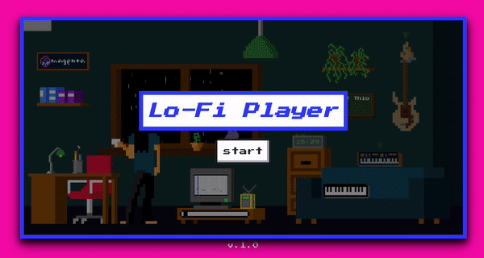

# Biblioteca - Teste Facilita





### Passo a passo Instalação

Clone Repositório

```sh
git clone https://github.com/ionansantos/teste-facilita
```

```sh
cd teste-facilita
```

Crie o Arquivo .env

```sh
cp .env.example .env
```

Suba os containers do projeto

```sh
docker compose up -d
```

Acesse o container app

```sh
docker exec -it teste-facilita-app-1 bash
```

Instale as dependências do projeto

```sh
composer install
```

Gere a key do projeto Laravel

```sh
php artisan key:generate
```

Rode as migrations

```sh
php artisan migrate
```

Rode as seeds

```sh
php artisan db:seed
```

no navegador acesse:
(http://localhost:8989)
